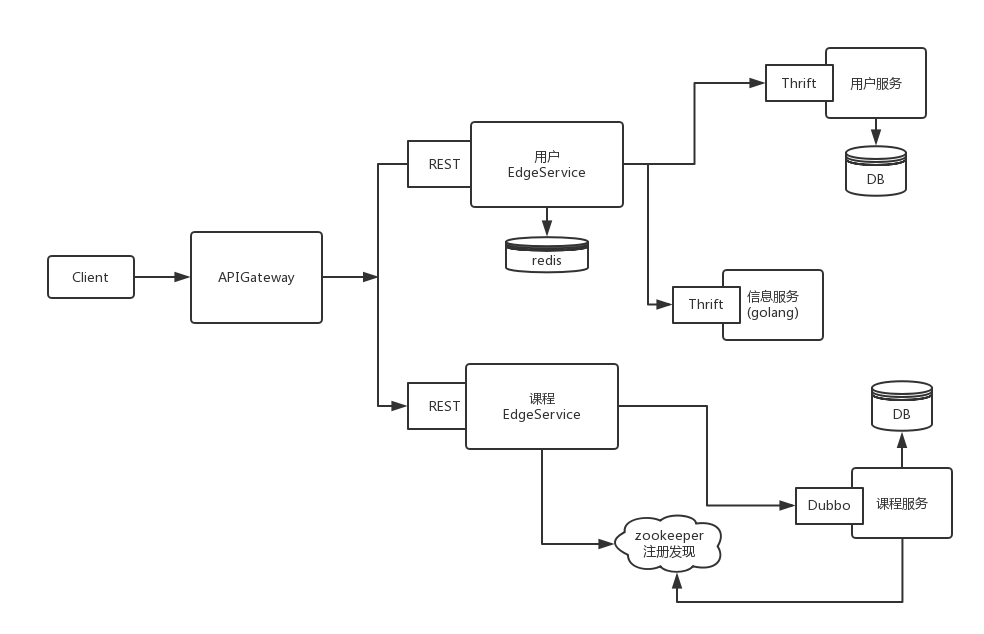

Micro-services
=====

慕课k8s微服务容器技术实战

项目架构
====
    

技术栈
===

> 1. k8s
> 2. SpringBoot
> 3. python
> 4. dubbo
> 5. thrift 
> 6. mesos+marathon

* 服务编排
* 服务发现
* mesos+marathon CICD搭建
* 实现简单登入

开发计划
====

目前项目开发中，存在诸多不足，以下是目前规划的开发计划。
实现k8s cicd搭建