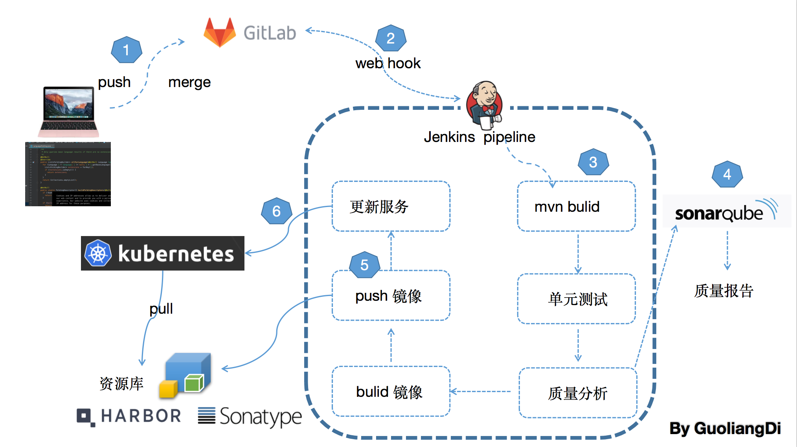

# k8s微服务容器技术实战

## 项目架构
---
  

## CICD流程
---
 
 
## 技术栈
---

> 1. k8s 
> 2. SpringBoot
> 3. python
> 4. dubbo
> 5. thrift 

* 实现各模块k8s服务编排
* 基于kubedns服务发现
* k8s CICD搭建
* 实现简单登入,短信,查询等功能
* 相关编排文件在cicd-config目录下
* 此项目重点不是业务开发,而是k8s cicd系统搭建,提供大家参考

## 总结:
服务编排过程中需要考虑多环境隔离,配置注入，Ingress代理暴露对外服务,cicd webhook自动构建项目拆分多个webhook实现自动构建